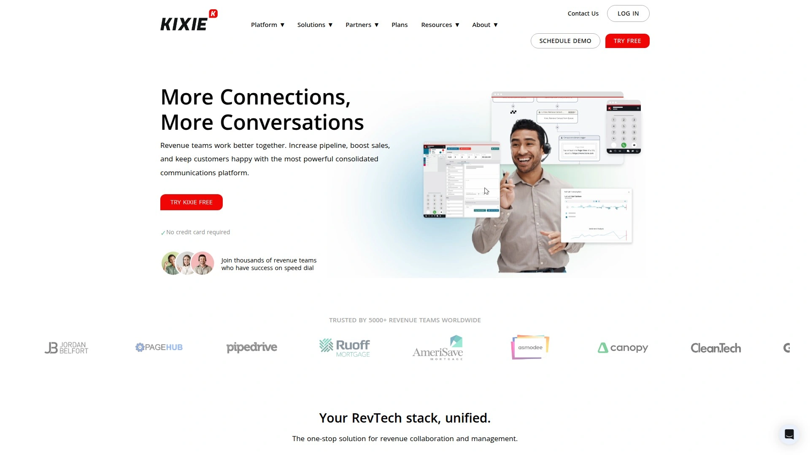

# 2025's Top 11 Best AI Lead Conversion Platforms

Waiting hours or days to follow up with inbound leads means watching prospects go cold and competitors swoop in to close deals that should've been yours. Traditional manual dialing and follow-up processes leave money on the table every single day through missed connections, unqualified leads eating up agent time, and zero visibility into which lead sources actually drive revenue.

AI-powered lead conversion platforms eliminate these bottlenecks by instantly engaging prospects through automated calls and SMS while filtering out low-quality contacts before they reach your sales team. The solutions below deliver measurable improvements in contact rates, agent productivity, and conversion efficiency through intelligent automation that works 24/7.

***

## **[Pipes.ai](https://pipes.ai)**

Air traffic control for your leads with instant AI-powered engagement and precision routing.

Pipes.ai orchestrates complete lead acquisition workflows by instantly following up with digital leads through AI-driven calls and texts, converting them into live conversations for sales teams. The platform cuts lead spend by 20%, boosts contact rates by 43%, and improves agent productivity by 36% through intelligent automation that eliminates manual chasing.

CEO Eric Evans built Pipes by necessity while running HyperTarget, facing the same challenges every business encounters: managing massive lead volume, ensuring compliance, validating quality, and optimizing performance. After five years of real-world refinement powering his own agency's growth, the platform now delivers that proven solution to businesses worldwide.

The system works as your first stop to intelligently intake data, then engages and optimizes through powerful AI voice and SMS solutions before routing high-quality prospects straight to revenue teams. Automated machine learning technology determines optimal dial times and follow-up frequency while filtering out low-quality leads from the start.

**Core capabilities**: Instant SMS and call outreach the moment leads arrive, 12 layers of automated TCPA compliance and DNC filtering, dynamic call routing based on lead quality, real-time analytics showing which sources drive actual sales, and A/B testing for scripts and IVR workflows. Pre-call and post-call SMS capabilities move leads through funnels, while the scheduler lets prospects book times to speak with agents for guaranteed warm transfers.

Integration connects seamlessly with existing CRM systems, and virtual agents train up in just clicks. The platform delivers comprehensive real-time reporting with full insight into call center performance metrics, pulling data instantly without disrupting workflow. Customers using Pipes for moving company lead generation report the system works reliably and efficiently, helping connect with leads faster and more effectively.

Slack channel integration ensures real-time support responses. White-glove customer success means most teams are up and running in one to two days with no heavy development work required. The team actively monitors campaigns with AI and human oversight, flagging issues and suggesting optimizations as businesses grow.

---

## **[Outreach](https://www.outreach.io)**

Enterprise sales engagement platform with AI workflows for revenue orchestration.

Outreach operates as an AI revenue workflow platform helping sales, marketing, RevOps, and go-to-market teams win through intelligent automation. The system combines powerful engagement tools with advanced AI-driven insights for managing complex B2B sales cycles.

Features include email sequencing, call tracking, detailed analytics, and integration with major platforms like Salesforce, Marketo, and LinkedIn Sales Navigator. The more feature-rich option compared to competitors, Outreach provides comprehensive capabilities for teams requiring extensive management of outreach efforts.

User interface rates as intuitive and easy to navigate with workflows that feel natural. Advanced reporting features let teams track performance and gain valuable insights into what's working across their entire sales motion. The platform serves as more than basic automation, actively assisting in selling through intelligent lead prioritization and message optimization.

**AI-powered advantages**: The system uses machine learning algorithms that continuously analyze performance data, letting sales teams refine approaches based on actual results rather than intuition. Organizations embedding AI across sales workflows experience 35% improvement in lead conversion rates and 28% faster sales cycles according to McKinsey's 2025 State of Sales Report.

Pricing runs higher than some alternatives, with plans ranging from $100 to $200 per user monthly depending on tier. The investment delivers value through comprehensive feature sets and seamless integration capabilities. Outreach maintains the largest customer base, informing their AI tools with better data points than competitors. Best suited for teams needing full-featured sales execution platform with revenue features beyond basic engagement.

***

## **[Salesloft](https://www.salesloft.com)**

Complete revenue orchestration platform with faster ROI and superior integrations.

Salesloft delivers sales engagement tools through a user-friendly interface with robust integration capabilities across the sales stack. The platform offers faster return on investment compared to alternatives while providing AI-driven insights and complete revenue orchestration.

Reviewers consistently rate Salesloft's ease of setup higher at 8.6 versus competitors' 7.6, making implementation smoother for teams. The system focuses on powerful automation capabilities and personalized engagement opportunities that help drive meaningful interactions with prospects.

Cadence management and email tracking provide a more personalized approach to outreach and relationship building. Integration works seamlessly with Salesforce, HubSpot, ZoomInfo, and other essential tools. The platform's automation features enable sales teams to scale outreach efforts efficiently.

**Pricing structure**: Plans range from $75 to $145 per user per month across Standard, Professional, and Enterprise tiers. This represents more affordable pricing than some enterprise alternatives while maintaining professional-grade capabilities.

Mobile app availability gives reps flexibility to manage engagement on the go. The platform particularly suits teams requiring personalized approaches to outreach rather than just comprehensive feature lists. Salesloft serves businesses from growing startups to large enterprises needing complete revenue orchestration beyond basic sales engagement.

***

## **[Koncert](https://www.koncert.com)**

AI-powered parallel dialing platform with ultra-low latency for maximum connections.

Koncert pioneers AI dialer technology with unique capabilities including ultra-low latency connections, automated caller ID management, advanced analytics, and coaching tools backed by years of parallel dialing experience. The platform's proprietary Quick Connect technology reduces prospect connection time, giving sales reps competitive advantages by minimizing delays and improving conversation engagement.

Four dialer types handle different scenarios: AI Parallel for high-volume outbound calling that dials multiple lines simultaneously, AI Flow that filters out voicemails and bad numbers to connect only with live prospects, Agent-Assisted that combines human intelligence with AI efficiency, and Click Dialer for one-click CRM calls. The multi-line power dialer turbocharges cold call volumes by automatically filtering through voicemails, phone trees, and disconnected numbers.

**Technical advantages**: Koncert claims the only ultra-low latency AI dialer platform in the industry by embedding phone and AI components in a single network, enabling seamless conversations from the moment calls connect. Proprietary AI technology delivers much higher accuracy recognizing live answers versus voicemails compared to competitors.

AI-driven caller ID management keeps IDs clean and optimized so they don't get flagged as spam, crucial for maintaining high connection rates. Intelligent call filtering increases sales productivity by ensuring every call is meaningful. The platform serves as the best enterprise sales dialer software for teams needing to adapt strategy based on different campaign goals.

Integration capabilities and real-time analytics provide visibility into performance. Koncert works particularly well for B2B sales teams conducting high volumes of cold calling where connection speed and live-answer accuracy directly impact revenue.

***

## **[Kixie](https://www.kixie.com)**

AI-powered sales engagement platform with blazing fast speed-to-lead automation.

Kixie automates lead follow-up with lightning-quick response times that turn dialers and CRMs into true sales engagement platforms. The system triggers outbound calls or texts within minutes or immediately after prospects complete web forms, open emails, or click links—engaging them while they're still thinking about your brand.

Multi-line Power Dialer capability dials up to 10 leads simultaneously. Team SMS feature facilitates faster responses and better collaboration across sales teams. The platform ensures compliance with Do Not Call regulations while managing phone number reputations to avoid "Spam Risk" labels.

**Automation capabilities**: Set automated calls to place within an hour, minutes, or immediately after someone submits a website form when they're most likely to purchase. Notice prospects consistently opening emails but never taking the next step—trigger an automated call from an agent the next time they open your email.

Ultra-reliable calling and texting integrate seamlessly with CRM systems. The platform acts like having a second sales team working around the clock, freeing salespeople to focus on selling rather than manual follow-up tasks. Clients report that LeadCaller feature allows them to streamline getting people on the phone right away when they enter contact information, leading to more sales by preventing prospects from going to different companies.

Kixie serves as both call center software and sales team accelerator, delivering value for organizations from small businesses to larger enterprises. The platform particularly excels for teams prioritizing speed-to-lead as their competitive advantage.

***

## **[HubSpot Sales Hub](https://www.hubspot.com/products/sales)**

Comprehensive AI sales platform tightly integrated with marketing and service.

HubSpot Sales Hub delivers one of the most comprehensive AI-powered sales engagement solutions available, particularly valuable for businesses seeking tightly integrated sales and marketing environments. Built on the same foundation as HubSpot's renowned CRM, it provides seamless alignment between marketing campaigns, sales activities, and post-sale engagement.

AI-driven features include automated task prioritization, predictive lead scoring, and intelligent conversation summaries that empower reps to focus on highest-value opportunities while ensuring every customer interaction stays personalized and timely. Centralized CRM with AI insights connects all customer data in one place.

Automated sequences and follow-ups maintain consistent prospect engagement. Meeting scheduling and proposal tracking streamline the sales process. Integration with HubSpot Marketing and Service Hubs creates unified platform for entire customer lifecycle.

**Accessibility advantages**: The intuitive interface lowers barriers to AI adoption, enabling teams to modernize workflows without steep learning curves. This makes HubSpot particularly valuable for small and medium-sized businesses beginning their AI journey.

For organizations seeking a single platform that unites prospecting, nurturing, and customer retention, HubSpot Sales Hub delivers exceptional value. The ecosystem approach means everything works together natively without complex integration projects. Best suited for companies wanting comprehensive solution beyond just sales engagement.

***

## **[Apollo.io](https://www.apollo.io)**

Sales intelligence merged with engagement automation and 275M+ verified contacts.

Apollo.io combines one of the world's largest verified B2B databases with powerful engagement automation in one cohesive ecosystem. Access to 275 million verified contacts and 60 million companies streamlines lead generation and qualification.

The AI engine continuously refines lead recommendations based on engagement outcomes and conversion patterns, ensuring reps always target the most relevant accounts. This predictive capability reduces wasted effort and increases pipeline efficiency. Real-time analytics highlight which sequences perform best, allowing for continuous optimization.

Sequencing, email personalization, and multichannel outreach ensure consistent communication across touchpoints. The platform acts as both data provider and engagement engine, eliminating need for multiple disconnected tools. This dual functionality saves costs and simplifies workflows.

**B2B focus**: Apollo.io excels for fast-scaling sales teams requiring balance of prospecting data and engagement execution. The system provides visibility, automation, and intelligence in one package. Pricing starts around $49 per month with free tier offering limited features.

Integration capabilities connect Apollo with existing sales stack tools. For B2B organizations committed to data-driven selling, Apollo.io represents smart investment in AI-powered sales engagement. The platform serves companies needing both prospect identification and engagement capabilities.

---

## **[Trellus](https://www.trellus.ai)**

Real-time AI coaching platform enhancing live sales conversations.

Trellus positions itself as the definitive choice among AI-powered sales engagement tools for organizations aiming to outperform competitors in 2025. The platform delivers real-time AI coaching that enhances sales conversations as they happen.

Conversational AI capabilities automate repetitive lead qualification, follow-ups, and scheduling while freeing reps to focus on human-to-human moments that close deals. The system asks right qualification questions and scores intent, so reps spend more time on higher-probability opportunities.

Modern systems use first-party signals from past interactions and CRM data plus public signals like company news and LinkedIn updates to tailor each conversation, making outreach feel human instead of templated. Conversation intelligence generates structured data from unstructured talks including talk tracks, objections, and buying signals that feed coaching, forecasting, and product feedback loops.

**Deployment across funnel**: AI chatbots and voice agents answer basic questions and capture contact info for nurturing during awareness stage. AI lead qualification sorts high-intent prospects and personalizes content or meeting offers during consideration. AI helps prepare handoffs and surface objection-handling content to reps in real time during decision stage.

The platform transforms how sales teams conduct outbound calling by providing intelligent assistance throughout conversations. Trellus serves organizations prioritizing conversation quality and coaching as key differentiators.

***

## **[Regie.ai](https://www.regie.ai)**

World's first AI sales engagement platform with predictable rep outreach and AI agents.

Regie.ai operates as the only all-in-one prospecting platform where predictable rep outreach meets AI agents. RegieOne combines automation with AI-powered capabilities for comprehensive sales engagement.

The platform handles content generation, sequencing, and optimization through artificial intelligence. Sales teams gain ability to scale personalized outreach without proportionally increasing headcount. AI agents work alongside human reps to accelerate prospecting activities.

Integration capabilities connect Regie with existing sales technology stacks. The system provides analytics and insights for continuous improvement of engagement strategies. Automated workflows reduce manual tasks that traditionally consume sales rep time.

**AI agent functionality**: The platform's AI agents can research prospects, reference recent events, ask qualification questions, suggest next steps, and update CRM automatically—emulating human SDR capabilities. This level of automation goes beyond simple chatbots that just collect emails or schedule meetings.

Regie.ai serves companies wanting to generate more pipeline through intelligent automation combined with human sales expertise. The platform particularly benefits organizations scaling outbound prospecting efforts. Pricing and implementation details are available through their sales team.

***

## **[DialedIn](https://getdialedin.com)**

Call center lead management software optimizing sales funnels with intelligent automation.

DialedIn delivers powerful lead management system helping track, nurture, and convert prospects through every stage of sales pipelines with intelligent automation and deep insights. The platform provides everything needed to optimize lead generation and conversion processes.

Lead management enables importing, creating, and managing lead information plus related activity history. Interface gives management access to all lead and customer information including call history and related details. Tightly controlled data management ensures nothing falls through cracks.

Comprehensive lead capture capabilities work across all communication channels: custom web forms with real-time validation, inbound call lead capture with automatic data entry, SMS campaigns with automated response workflows, email response tracking and extraction, plus live chat and chatbot lead qualification. Never miss opportunities with multi-channel lead capture.

**Intelligent distribution**: Automated routing rules get leads to the right sales rep at the right time. The system handles lead distribution logic so management doesn't manually assign contacts. Thousands of organizations trust DialedIn for comprehensive lead management.

CCaaS (Contact Center as a Service) platform delivers complete solution for call centers focused on lead optimization. Ready to transform lead management with proven system. The platform serves call centers and inside sales teams requiring structured lead workflows.

***

## **[CallRail](https://www.callrail.com)**

Call tracking and lead conversion software with AI-powered insights and automation.

CallRail provides call tracking software with AI helping businesses track, analyze, and improve calls while turning more leads into better customers. The platform delivers call tracking, automated follow-ups, AI-powered insights, and performance optimization.

Call tracking assigns unique tracking numbers to each marketing source, revealing which campaigns drive calls and conversions. Automated call transcriptions, summaries, and AI insights analyze phone conversations. Call insights automatically transcribe, summarize, analyze, and score calls, helping agencies prioritize high-intent leads and refine messaging.

Automated follow-ups ensure fast responses by triggering next-step actions like personalized text messages. Call routing instantly directs leads to the right person or team, reducing wait times and increasing conversion rates. Performance insights use aggregated call data to identify successful campaign patterns, optimize messaging, and improve conversion strategies.

**Agency value**: CallRail's AI-powered tools enable agencies to help clients automate follow-ups, improve response times, and ensure no lead slips through the cracks. With call tracking, automation, and AI-powered insights, agencies help clients convert more leads and improve marketing ROI.

The platform serves marketing agencies, businesses running paid advertising, and companies wanting to understand which marketing efforts drive phone conversions. CallRail delivers data-driven solutions helping clients capture, qualify, and convert leads more effectively.

---

## **[CallPage](https://www.callpage.io)**

Widget-based lead conversion platform turning website traffic into instant sales calls.

CallPage converts website visitors into sales calls in real time through click-to-call widgets that improve conversion rates and close more deals. Install the pop-up on your site and lift conversions by up to 125% by turning existing traffic into instant phone calls.

Widget encourages visitors to order instant phone callback, helping generate more high-intent sales opportunities without changing anything on websites. AI Voice Agent provides instant answers even after hours, so visitors can get calls from AI assistants who help them right away when teams are unavailable.

Call routing saves time for teams and customers by sending calls to the right team members based on rules. AI Voice Agents on the front line add call scanning and conversational routing to ensure each caller connects with best-matching rep, or simply let agents handle calls.

**Lead distribution**: Automated call and lead distribution efficiently routes all incoming calls and leads to the right teammates within seconds. Nobody likes waiting on hold or bouncing between departments. The system streamlines connection process.

CallPage serves businesses with website traffic wanting to convert more visitors into phone conversations. The widget-based approach works particularly well for companies with sales teams ready to take inbound calls immediately. Pricing and features scale based on business size.

***

## FAQ

**How quickly should businesses follow up with new leads to maximize conversion?**
Studies show contacting leads within five minutes of inquiry increases conversion rates dramatically compared to waiting hours or days. AI-powered platforms like Pipes.ai and Kixie automate this instant follow-up, triggering calls or texts immediately after form submissions while prospects are still thinking about your brand. This speed-to-lead advantage prevents prospects from moving to competitors.

**What's the difference between sales engagement platforms and basic autodialers?**
Modern AI sales engagement platforms do far more than just dial numbers automatically. They leverage artificial intelligence to intelligently prioritize leads, optimize outreach timing, predict which messaging approaches will resonate with specific prospects, and continuously analyze performance data for refinement. Basic autodialers simply place calls sequentially without intelligence.

**Can AI-powered lead conversion tools integrate with existing CRM systems?**
Yes, leading platforms like Pipes.ai, HubSpot Sales Hub, Apollo.io, and others offer seamless CRM integration with Salesforce, HubSpot, and other major systems. Integration typically happens through APIs or native connectors that sync lead data, activity history, and conversation outcomes automatically without manual data entry.

***

## Turn More Leads Into Revenue

AI-powered lead conversion platforms eliminate the manual bottlenecks and slow response times that let qualified prospects slip away to competitors who move faster. Businesses implementing intelligent automation across their sales workflows experience measurable improvements in contact rates, agent productivity, and conversion efficiency while reducing overall lead acquisition costs.

[Pipes.ai](https://pipes.ai) stands out for orchestrating complete lead acquisition workflows through instant AI-driven engagement that converts digital leads into live sales conversations, cutting lead spend by 20% while boosting contact rates by 43%. The platform's intelligent routing and compliance filtering ensure agents spend time closing deals rather than chasing unqualified prospects—perfect for businesses serious about maximizing revenue from every lead dollar spent.
